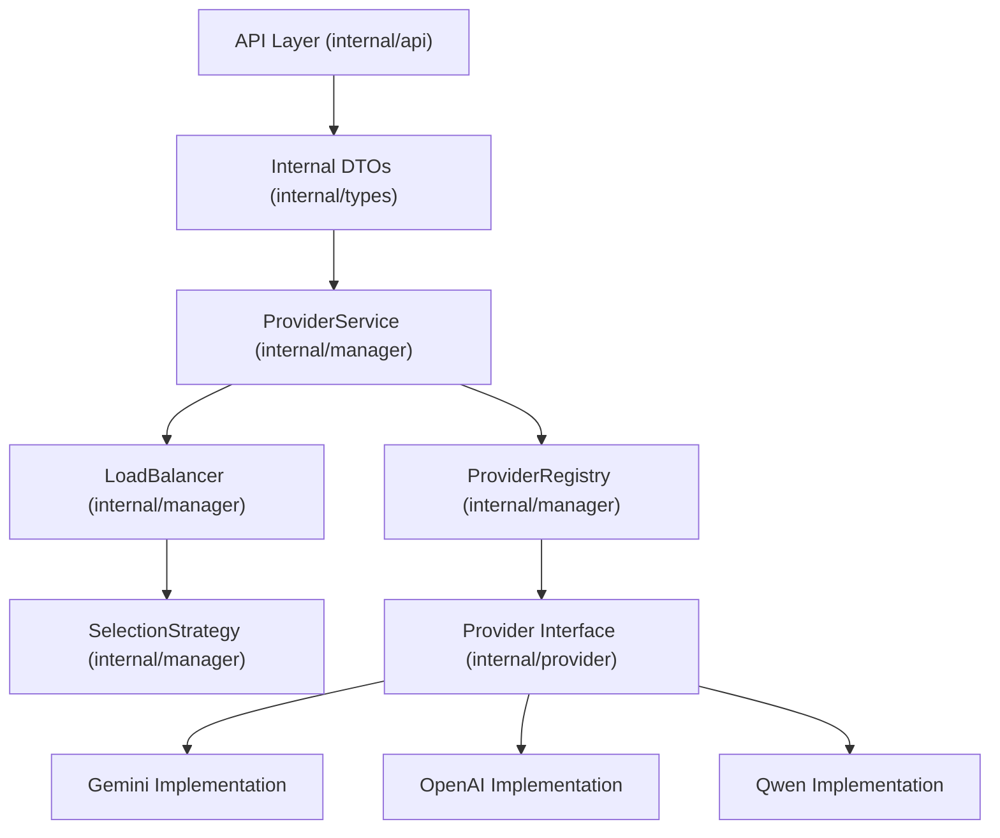

# Omniproxy Refactor Plan

This document outlines the plan to refactor the Omniproxy codebase to improve maintainability, extensibility, and performance.

## Objectives

- **Unify Protocol Handling**: Reduce duplication between OpenAI-compatible and Gemini-native paths.
- **Decouple from External SDKs**: Introduce internal DTOs to make the system resilient to external library changes.
- **Improve Extensibility**: Use the Strategy pattern for load balancing and provider selection.
- **Centralize Error Handling**: Ensure consistent error responses across all providers.
- **Optimize Performance**: Use `sync.Pool` for high-frequency allocations and ensure efficient resource usage.

## Architecture Overview



## Detailed Steps

### 1. Unified Provider Interface
Define a single `Provider` interface in `internal/provider/interfaces.go` that abstracts away protocol-specific details.

```go
type Provider interface {
    BaseProvider
    Execute(ctx context.Context, req interface{}) (interface{}, error)
    Stream(ctx context.Context, req interface{}) (<-chan interface{}, <-chan error)
}
```

### 2. Strategy-Based Load Balancing
Refactor `LoadBalancer` to use a `SelectionStrategy` interface.

- `RoundRobinStrategy`: Standard round-robin selection.
- `RateLimitAwareStrategy`: Selection based on provider health and rate limit status.

### 3. Internal DTOs
Create a new package `internal/types` to hold internal request and response structures. This decouples the core logic from `go-openai` and `genai` SDK types.

### 4. Provider Implementation Refactor
Update all existing providers (`gemini`, `openai`, `qwen`, `iflow`, `antigravity`) to implement the new unified `Provider` interface and handle their own request/response mapping.

### 5. Service Layer Refactor
Simplify `ProviderService` to work with the unified `Provider` interface, removing protocol-specific methods like `GetOpenAIProvider`.

### 6. API Layer Update
Update handlers in `internal/api` to use the new internal DTOs and the refactored `ProviderService`.

### 7. Centralized Error Mapping
Implement a unified error mapping system in `internal/provider/errors.go` to translate provider-specific errors into consistent internal `ProviderError` types.

### 8. Performance Optimizations
- Implement `sync.Pool` for DTOs and buffers.
- Ensure efficient connection pooling in HTTP clients.

### 9. Cleanup
Remove redundant code in `poc/` and `cmd/` directories once the refactor is complete and verified.

## Execution Order

1.  **Foundation**: `internal/provider/interfaces.go` & `internal/types`.
2.  **Core Logic**: `internal/manager/loadbalancer.go` & `internal/manager/registry.go`.
3.  **Implementations**: Refactor each provider one by one.
4.  **Orchestration**: `internal/manager/service.go`.
5.  **Entry Points**: `internal/api` & `cmd/omniproxy`.
6.  **Cleanup**: Remove old code.
