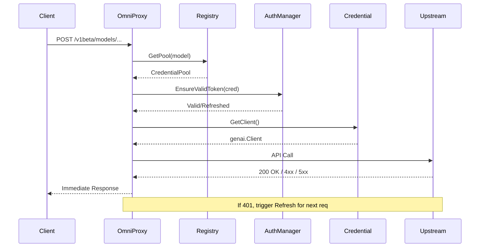

# OmniProxy V2 Architecture Documentation

## 1. Overview
The OmniProxy V2 architecture is a major refactor designed to solve critical issues in the original implementation, specifically regarding **credential caching in GenAI clients** and **unnecessary architectural complexity**.

### Key Design Goals
- **Fix Credential Caching:** Ensure that refreshed OAuth tokens are actually picked up by the `genai.Client`.
- **Dumb Client Pattern:** Providers should be stateless "borrowers" of clients, not managers of their own state.
- **Fast Fail Routing:** Remove internal retry loops in favor of client-side retry logic, providing better transparency to modern AI clients.
- **Proactive Auth:** Check token validity *before* sending requests to minimize 401 errors.

### Status: ✅ Complete
The V2 refactor is now fully implemented and functional. All V1 legacy code has been removed, and the application runs exclusively on the V2 architecture.

---

## 2. Solving the GenAI Caching Issue

### The Problem
Validation revealed that the Google `genai.Client` SDK caches the initial credentials provided at creation. Simply updating the token in a shared `TokenProvider` does not affect existing client instances.

### The Solution: Client Pool & Rotation
We introduced a **Client Pool** pattern within the `internal/auth` package.
- **`ClientPool`**: Manages a slice of `genai.Client` instances.
- **Rotation**: When a token is refreshed (or a 401 occurs), a **new** `genai.Client` is instantiated and pushed to the pool, becoming the new "current" client.
- **Typed Nil Interface Fix**: Updated `Credential.GetClient()` to handle the "nil interface" gotcha in Go, ensuring consumers receive a true `nil` instead of a typed nil pointer when no client is available.

---

## 3. Core Components (V2)

### 3.1 Authentication Manager (`internal/auth`)
- **`Credential`**: Now a stateful entity holding tokens, expiry, and its own `ClientPool`.
- **`AuthManager`**: The central orchestrator for token lifecycle. It handles:
    - **Proactive Check**: `EnsureValidToken` checks if a token expires within 1 minute.
    - **Reactive Refresh**: `ForceRefresh` and `RefreshClient` are called when a 401 is detected.
- **`TokenProviderAdapter`**: Bridges our `Credential` system with the `cloud.google.com/go/auth` interface required by the GenAI SDK.

### 3.2 Registry & Factory (`internal/manager`)
- **`Registry` (V2)**: Replaced the complex provider-based registry with a direct mapping of **Virtual Models** (e.g., `gemini-1.5-pro`) to a **`CredentialPool`**.
- **`CredentialFactory`**: Initializes `Credential` objects from configuration files, performs initial authentication, and registers them to supported models. Uses dynamic model discovery from provider instances.

### 3.3 Smart Router V2 (`internal/router`)
Implements the **Fast Fail** execution flow:
1. **Select**: Picks the next available `Credential` from the pool (Round-robin).
2. **Auth Check**: Calls `AuthManager.EnsureValidToken`.
3. **Borrow Client**: Retrieves a `genai.Client` from the credential's pool.
4. **Execute**: Performs the API call.
5. **Report**: Returns the result (Success or Error) immediately to the client. If a 401 occurs, it triggers a background refresh of the credential so the *next* request succeeds.

### 3.4 Request Parsing (`internal/api`)
- **Structured Type Parsing**: Requests are parsed directly into structured types (`GeminiRequest`, `optimizedContent`, `optimizedPart`) instead of going through `map[string]interface{}` round-trips.
- **Custom Unmarshalers**: `thoughtSignature` type has custom `UnmarshalJSON` to handle both base64-encoded and plain string formats.
- **No Data Corruption**: Direct parsing eliminates data corruption issues that occurred with marshal/unmarshal round-trips.

---

## 4. Request Lifecycle (Fast Fail)

Unlike V1, which attempted to retry internally, V2 follows this path:



---

## 5. File Structure Changes

### Deleted V1 Files
The following legacy V1 files have been deleted as part of the V2 migration:
- `manager/provider_factory.go` (replaced by `credential_factory.go`)
- `manager/registry.go` (replaced by `registry_v2.go`)
- `manager/service.go` (V1-specific provider service)
- `manager/pool_manager_adapter.go` (V1-specific adapter)
- `manager/loadbalancer.go` (V1-specific load balancer)
- `router/smart_router.go` (replaced by `smart_router_v2.go`)
- `api/router.go` (replaced by `server_v2.go`)
- `api/gemini.go` (V1-specific Gemini handlers)
- `api/openai.go` (V1-specific OpenAI handlers)

### Current V2 Structure
| Component | File(s) |
| :--- | :--- |
| **Registry** | `manager/registry_v2.go` |
| **Factory** | `manager/credential_factory.go` |
| **Cleanup** | `manager/cleanup.go` |
| **Routing** | `router/smart_router_v2.go`, `router/gemini_helpers.go` |
| **Server** | `api/server_v2.go` |
| **Auth** | `auth/manager.go`, `auth/client_pool.go`, `auth/types.go` |
| **Pool** | `manager/pool.go` |

---

## 6. Migration Status

### Completed
- [x] Gemini Protocol implementation in V2.
- [x] Antigravity Protocol implementation in V2.
- [x] OpenAI Protocol implementation in V2.
- [x] OAuth Token Refresh flow for Gemini/Antigravity/Qwen/IFlow.
- [x] Client Pool for GenAI-based providers.
- [x] Porting OpenAI protocol execution logic to `SmartRouterV2`.
- [x] Updating `StartCleanupRoutine` to target V2 `CredentialPools`.
- [x] Deleting legacy V1 manager and provider files.
- [x] Project ID discovery for Gemini providers (dynamic vs hardcoded).
- [x] Thought signature handling for multi-turn conversations.
- [x] `/v1/models` endpoint with OpenAI-compatible model filtering.
- [x] Request/response parsing using structured types (no map round-trip).

### All Tasks Completed ✅
The V2 refactor is now complete and fully functional.

---

## 7. How to Use
The application is now wired to use V2 by default in `cmd/omniproxy/main.go`.
- Config files remain compatible.
- The server listens on the same port but uses the `ServerV2` handler.
- Logs will indicate `OmniProxy (V2)...` at startup.

---

## 8. Key Improvements & Fixes

### 8.1 Project ID Discovery
**Problem:** V2 initially hardcoded the project ID to `"genai-genesis"`, causing 403 permission denied errors.

**Solution:** Implemented dynamic project ID discovery using `gemini.DiscoverProjectID()` which calls the Google Cloud Code Assist API to discover the correct project ID for each credential.

### 8.2 Thought Signature Handling
**Problem:** Multi-turn conversations with tool calls require the `thought_signature` field to be preserved between requests. The old implementation used a custom unmarshaler, but V2 was doing an extra marshal/unmarshal round-trip through `map[string]interface{}` which corrupted the data.

**Solution:** 
- Restored direct parsing into structured types (`GeminiRequest`, `optimizedContent`, `optimizedPart`)
- Custom `UnmarshalJSON` on `thoughtSignature` handles both base64-encoded and plain string formats
- No data corruption from round-trip through maps

### 8.3 OpenAI Protocol Support
**Problem:** V2 only implemented Gemini protocol initially.

**Solution:** Added full OpenAI protocol support:
- `/v1/chat/completions` endpoint for non-streaming requests
- `/v1/chat/completions` endpoint for streaming requests
- `/v1/models` endpoint that only returns OpenAI-compatible models (Qwen, IFlow)
- Provider instances created and set in credentials for OpenAI providers

### 8.4 Model List Endpoint
**Problem:** The `/v1/models` endpoint was returning all models including Gemini/Antigravity, which are not OpenAI-compatible.

**Solution:** Implemented filtering logic to only return models from OpenAI-compatible providers (Qwen, IFlow) when accessing `/v1/models`.

### 8.5 Antigravity Path Fix
**Problem:** Antigravity credentials were failing with doubled paths like `/home/kslam/home/kslam/.antigravity/oauth_creds.json`.

**Solution:** Updated `GetCredentialsPath()` to check if `CredsDir` is an absolute path and use it directly instead of always joining with home directory.

---

## 9. API Endpoints

### 9.1 Gemini Protocol
- `POST /v1beta/models/{model}:generateContent` - Non-streaming
- `POST /v1beta/models/{model}:streamGenerateContent?alt=sse` - Streaming

### 9.2 OpenAI Protocol
- `POST /v1/chat/completions` - Chat completions (streaming and non-streaming)
- `GET /v1/models` - List OpenAI-compatible models only

### 9.3 Health
- `GET /health` - Health check endpoint

---

## 10. Supported Providers & Models

### 10.1 Gemini-Native Providers
These providers use the Google GenAI SDK and support the Gemini protocol.

**Gemini:**
- `gemini-2.5-flash`, `gemini-2.5-flash-lite`, `gemini-2.5-pro`, `gemini-2.5-pro-preview-06-05`, `gemini-2.5-flash-preview-09-2025`, `gemini-3-pro-preview`, `gemini-3-flash-preview`

**Antigravity:**
- All Gemini models plus: `claude-sonnet-4-5`, `claude-sonnet-4-5-thinking`, `claude-opus-4-5-thinking`, `gpt-oss-120b-medium`, `rev19-uic3-1p`, `chat_23310`, `chat_20706`

### 10.2 OpenAI-Compatible Providers
These providers support the OpenAI protocol and are accessible via `/v1/chat/completions` and `/v1/models`.

**Qwen:**
- `qwen3-coder-plus`, `qwen3-coder-flash`

**IFlow:**
- `qwen3-coder-plus`, `qwen3-max`, `qwen3-vl-plus`, `kimi-k2-0905`, `kimi-k2`, `glm-4.6`, `glm-4.7`, `deepseek-v3.2`, `deepseek-r1`

---

## 11. Testing the V2 Implementation

### Test Gemini Non-Streaming
```bash
curl -X POST "http://127.0.0.1:8143/v1beta/models/gemini-3-flash-preview:generateContent" \
  -H "Content-Type: application/json" \
  -d '{"contents":[{"role":"user","parts":[{"text":"Hello, what is 2+2?"}]}]}'
```

### Test Gemini Streaming
```bash
curl -X POST "http://127.0.0.1:8143/v1beta/models/gemini-3-flash-preview:streamGenerateContent?alt=sse" \
  -H "Content-Type: application/json" \
  -d '{"contents":[{"role":"user","parts":[{"text":"Hello, what is 2+2?"}]}]}'
```

### Test OpenAI Protocol
```bash
curl -X POST "http://127.0.0.1:8143/v1/chat/completions" \
  -H "Content-Type: application/json" \
  -d '{"model":"qwen3-coder-plus","messages":[{"role":"user","content":"Hello"}]}'
```

### List OpenAI-Compatible Models
```bash
curl "http://127.0.0.1:8143/v1/models"
```
