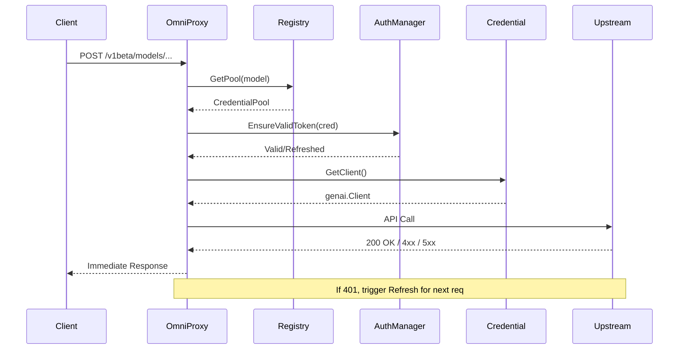

# OmniProxy System Architecture & Design

## 1. High-Level Architecture
OmniProxy is a high-performance, intelligent proxy for Generative AI models. It acts as a unified gateway that routes requests to various upstream providers (Google Gemini, Antigravity, OpenAI, etc.) while handling authentication, load balancing, and protocol translation.

The system is built on a layered architecture:

-   **API Layer (`internal/api`)**: Entry point for HTTP/REST requests. Handles protocol-specific parsing (OpenAI vs. GenAI) and stream management.
-   **Router Layer (`internal/router`)**: The core intelligence. `SmartRouterV2` decides which credential to use, handles retries, and manages failovers.
-   **Manager Layer (`internal/manager`)**: Maintains the state of model credentials. The `Registry` groups credentials into pools by model name.
-   **Auth Layer (`internal/auth`)**: Centralizes credential security. `AuthManager` handles token validation, automatic refreshing ("Lazarus Protocol"), and client initialization.
-   **Provider Layer (`internal/provider`)**: Adapters for upstream APIs. Standardizes different backends into common interfaces (`OpenAICompatibleProvider`, `GeminiNativeProvider`).

## 2. Core Components & Logic

### 2.1 Smart Routing (`SmartRouterV2`)
The router implements a "Fast Fail" philosophy combined with intelligent recovery.

-   **Credential Selection**: Requests are load-balanced across available credentials for the requested model.
-   **Rate Limit Handling**:
    -   Intercepts `429 Too Many Requests` errors.
    -   Extracts `Retry-After` or quota reset times (handling various upstream formats).
    -   Places credentials in a temporary "Penalty Box" until the reset time expires.
    -   Returns standard `Retry-After` headers to the client.
-   **Failover**: If a credential fails, the router records the error. Rate-limited credentials are skipped in future selections.

### 2.2 Credential Management (`Registry` & `CredentialPool`)
Credentials are managed in-memory, grouped by model name (e.g., `gemini-1.5-pro`).

-   **Round-Robin Selection**: The pool selects the credential with the oldest `LastUsedAt` timestamp to ensure even distribution.
-   **Penalty Box Logic**: Credentials with an active `AvailableAt` timestamp (set by 429 errors) are skipped.
-   **Dead State**: Credentials with excessive failures or unrecoverable auth errors are marked as `DEAD` and removed from rotation.

### 2.3 Authentication & "Lazarus Protocol" (`AuthManager`)
One of the system's key features is its self-healing authentication mechanism.

-   **Proactive Check**: Before every request, the router checks if the selected credential's token is valid.
-   **Lazarus Protocol (Reactive Recovery)**:
    -   If an upstream provider returns `401 Unauthorized`, the router catches it.
    -   Triggers a `ForceRefresh` via `AuthManager`.
    -   If refresh succeeds, the request is automatically retried with the new token.
    -   If refresh fails, the credential is permanently marked as `DEAD`.

## 3. Request Lifecycle Diagram

The "Fast Fail" execution flow ensures low latency and clear feedback:



## 4. Supported Protocols
The system supports two primary protocol families:

1.  **OpenAI Protocol**: Standard `/v1/chat/completions`.
    -   Used for OpenAI, Qwen, iFlow, and DeepSeek models.
    -   Supports strictly compliant streaming (including `data: [DONE]`).
2.  **GenAI (Gemini) Protocol**: `/v1beta/models/...:generateContent`.
    -   Used for Google Gemini and Antigravity models.
    -   Supports both unary and streaming responses via `text/event-stream`.

## 4. Key Design Decisions

### 4.1 In-Memory State
Credential state (failure counts, penalty timers) is kept in memory.
-   **Pros**: Ultra-low latency, no external database dependency.
-   **Cons**: State is lost on restart (mitigated by fast startup and stateless token-based auth).

### 5.2 Generic Provider Errors
All upstream errors are normalized into `ProviderError`.
-   **Benefit**: The frontend/client receives a consistent error format regardless of whether the backend is Google, OpenAI, or a custom internal service.
-   **Format**: `{"error": {"code": 429, "message": "...", "status": "TOO_MANY_REQUESTS"}}`

### 5.3 Client Pooling
Provider clients (e.g., `genai.Client`) are pooled and associated with credentials.
-   **Reason**: Cache initial credentials provided at creation. Simply updating the token in a shared `TokenProvider` does not affect existing client instances, so we rotate clients on refresh.

### 5.4 Thought Signature Handling
Multi-turn conversations with tool calls require the `thought_signature` field to be preserved between requests.
-   **Implementation**: A custom `thoughtSignature` type in `internal/api/gemini.go` implements `UnmarshalJSON`.
-   **Optimization**: It handles both standard base64-encoded strings and potential plain-string edge cases in a single pass, avoiding expensive map round-trips.

## 6. Developer Guide

### Adding a New Provider
1.  Define the provider type in `internal/auth/types.go` and `internal/provider/types.go`.
2.  Implement the provider interface in `internal/provider/<new_provider>/`.
3.  Add auth refresh logic in `internal/auth/manager.go`.
4.  Register the provider in `internal/manager/credential_factory.go`.

### Debugging Tips
-   **Rate Limits**: Check logs for "entered penalty box". The `Registry` logs detailed reasons for skipping credentials.
-   **Auth Failures**: Look for "Lazarus Protocol" logs to see if tokens are failing to refresh.

## 7. Troubleshooting & Recovery

### Refresh Token Failures (401)
If the "Lazarus Protocol" fails (e.g., refresh token is expired or revoked), the system will mark the credential as `DEAD`.

**Recovery Path:**
1.  **Detect**: Check logs for `Token refresh failed with 401`.
2.  **Re-authenticate**: Manually run the auth tool:
    ```bash
    ./newprofile --provider gemini
    ```
3.  **Restart**: The service must be restarted to load the new credentials file:
    ```bash
    systemctl restart omniproxy
    ```

## 8. Verification Commands

### Test Gemini Protocol
```bash
curl -X POST "http://127.0.0.1:8143/v1beta/models/gemini-3-flash-preview:generateContent" \
  -H "Content-Type: application/json" \
  -d '{"contents":[{"role":"user","parts":[{"text":"Hello"}]}]}'
```

### Test OpenAI Protocol
```bash
curl -X POST "http://127.0.0.1:8143/v1/chat/completions" \
  -H "Content-Type: application/json" \
  -d '{"model":"qwen3-coder-plus","messages":[{"role":"user","content":"Hello"}]}'
```
